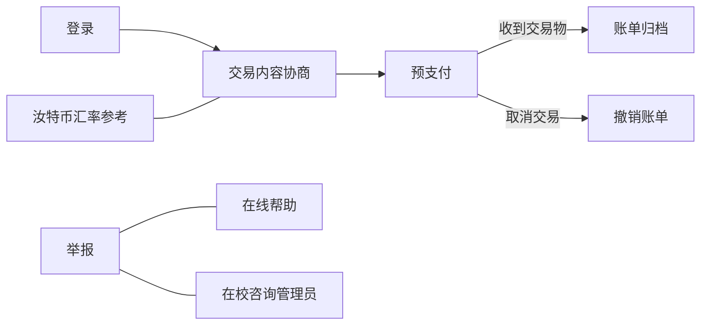

# 汝特币项目启动通知

**汝特币交易平台项目（Rootcoin Exchanging Platform, RtcEP）**启动。

## 汝特币平台的核心功能设计

汝特币平台将作为一个虚拟货币交易平台，进行联网运作。

所有注册用户享有汝特币平台的使用权。

**使用流程如下。**

交易平台的汝特币对现金的汇率是恒定的，所以它不会出现内部通货膨胀，因为汝特币的形式只是账单。汝特币依附于现金，但是**汝特币不与其他数字形式的钱币互通**。如果需要将汝特币兑换成现金，需要将现金作为交易品进行交易。

## 汝特币平台的预期作用

根据此产品的原型功能，汝特币平台的主要作为一种便捷的班内工具。不过，我们也计划**在平台中加入由教师使用的管理员用户，以作为类似于德育分的奖励机制。管理员用户只具有发放奖励金的权力。**

## 开发计划

汝特币平台的开发会包括Windows版本和Android版本。前期主要面向Windows用户，但是在平台较为成熟之后会转向Android重点开发，以方便多数学生的使用。

Pray the Ken,

5/24/2019